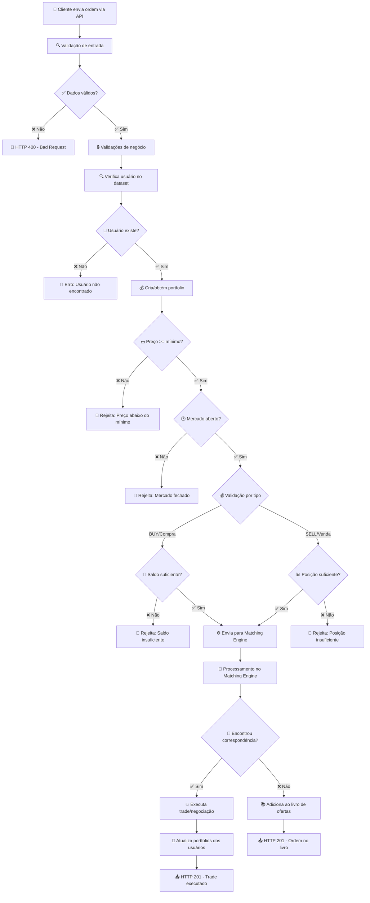
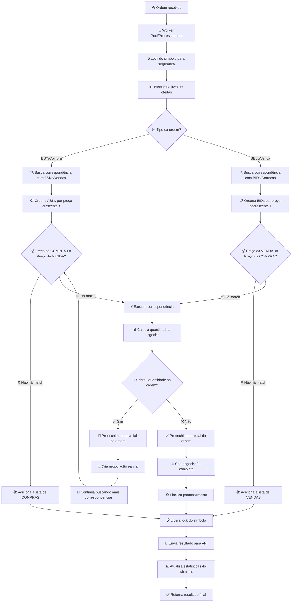
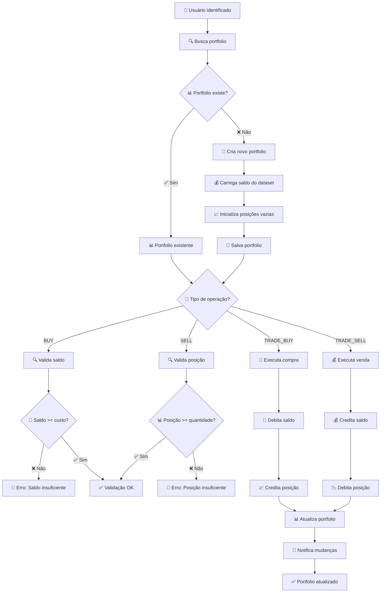

# Sistema de Trading - Desafio Avenue

## 🎯 Objetivo

Desenvolver um sistema de trading que processa ordens de compra e venda de ações americanas em "tempo real", fazendo o matching (correspondência) entre compradores e vendedores com validações de negócio robustas.

## 📋 Contexto

No mercado financeiro moderno, sistemas de trading precisam:

* Processar **milhares de ordens por segundo** com alta performance
* Fazer matching entre compradores e vendedores **instantaneamente**
* Implementar **validações de negócio** (saldo, posição, horário de mercado)
* Manter **order books** (livros de ofertas) atualizados
* Suportar **múltiplos perfis** de usuário com diferentes limites
* Garantir **atomicidade** nas operações de trade

## 🚀 Quick Start

### Pré-requisitos
- Go 1.21+
- Docker & Docker Compose (opcional)

### Instalação Rápida

```bash
# Clone o repositório
git clone <repository-url>
cd trading

# Execute com Make
make setup && make run-web

# Ou execute diretamente
go mod tidy
go run internal/services/web/cmd/main.go
```

### Acesso
- 📚 **API Base**: http://localhost:8080/api
- ❤️ **Health Check**: http://localhost:8080/api/health
- 📊 **Order Book**: http://localhost:8080/api/orderbook/AAPL
- 👤 **Portfolio**: http://localhost:8080/api/portfolio/ana-silva
- 📈 **Orders**: http://localhost:8080/api/orders

### 🎯 O que implementar

Este é um **boilerplate** onde você deve implementar:

#### 1. **Matching Engine** (`internal/services/engine/matching/engine.go`)
- Algoritmo price-time priority
- Busca de correspondências entre ordens
- Execução de trades
- Preenchimento parcial de ordens

#### 2. **Order Book** (`internal/services/engine/orderbook/manager.go`)
- Gerenciamento de livros de ofertas por símbolo
- Organização de bids (preço decrescente) e asks (preço crescente)
- Adição/remoção de ordens
- Busca de melhores correspondências

#### 3. **Portfolio Service** (`internal/services/engine/portfolio/service.go`)
- Carregamento de dados de usuários do JSON
- Validação de saldos e posições
- Execução de trades (atualização de saldos/posições)
- Criação e gerenciamento de portfolios

#### 4. **Business Validators** (`internal/services/shared/validators/business.go`)
- Validação de símbolos (20 ações disponíveis)
- Validação de preços mínimos por ação
- Validação de horário de mercado (NYSE 9:30-16:00 EST)
- Validação de feriados

#### 5. **Handler Logic** (`internal/services/web/handlers/trading_handler.go`)
- Implementar lógica real nos handlers (atualmente retornam apenas "OK")
- Integrar com os services do engine
- Retornar JSON estruturado
- Tratamento de erros adequado

### 🏁 Status Atual

**✅ Funcionando:**
- Estrutura do projeto seguindo padrão Avenue
- Web service com go-restful
- Todos os endpoints retornando "OK"
- Datasets de usuários e ações
- Makefile com comandos úteis

**🚧 Para Implementar:**
- Toda a lógica de negócio dos services
- Matching engine completo
- Validações de negócio
- Integração entre web service e engine

## 📊 Datasets Fornecidos

### 👥 Usuários Brasileiros (12 perfis)

| ID | Nome | Perfil | Saldo | Limite/Ordem | Descrição |
|----|------|--------|-------|--------------|-----------|
| ana-silva | Ana Silva | Conservador | R$ 5.000 | R$ 500 | Professora, primeira vez investindo |
| carlos-santos | Carlos Santos | Moderado | R$ 25.000 | R$ 2.500 | Engenheiro, 2 anos de experiência |
| beatriz-costa | Beatriz Costa | Agressivo | R$ 100.000 | R$ 10.000 | Trader profissional |
| diego-oliveira | Diego Oliveira | Institucional | R$ 2.000.000 | R$ 200.000 | Gestor de fundos |
| elena-rodriguez | Elena Rodriguez | Premium | R$ 10.000.000 | Ilimitado | High frequency trader |

### 📈 Ações Americanas (20 símbolos)

| Símbolo | Empresa | Setor | Preço Mín | Market Cap |
|---------|---------|-------|-----------|------------|
| AAPL | Apple Inc. | Tecnologia | $200.00 | $2.8T |
| MSFT | Microsoft Corp. | Tecnologia | $150.00 | $2.6T |
| GOOGL | Alphabet Inc. | Tecnologia | $150.00 | $1.7T |
| TSLA | Tesla Inc. | Automotivo | $100.00 | $800B |
| NVDA | NVIDIA Corp. | Tecnologia | $200.00 | $1.2T |

## 🔧 Regras de Negócio Obrigatórias

### 1. Validações por Perfil de Usuário

| Perfil | Limite por Ordem | Tolerância a Risco | Experiência |
|--------|------------------|-------------------|-------------|
| **Conservador** | Máximo 10% do patrimônio | Baixa | Iniciante |
| **Moderado** | Máximo 15% do patrimônio | Média | Intermediário |
| **Agressivo** | Máximo 25% do patrimônio | Alta | Avançado |
| **Institucional** | Máximo 30% do patrimônio | Controlada | Profissional |
| **Premium** | Sem limites | Gerenciada | Especialista |

### 2. Validações por Ação

**Preços Mínimos Obrigatórios**:
- AAPL (Apple): $200.00
- MSFT (Microsoft): $150.00
- NVDA (NVIDIA): $200.00
- UNH (UnitedHealth): $300.00
- NFLX (Netflix): $300.00
- MA (Mastercard): $200.00
- HD (Home Depot): $200.00
- V (Visa): $150.00
- META (Meta): $150.00
- GOOGL (Alphabet): $150.00

### 3. Validações de Mercado

**Horário de Funcionamento NYSE**:
- **Dias**: Segunda a Sábado (exceção para o evento)
- **Horário**: 9:30 AM - 4:00 PM EST
- **Fuso**: America/New_York
- **Domingo**: Sempre fechado

## 📈 API Endpoints Obrigatórios

| Método | Endpoint | Descrição | Status Esperado |
|--------|----------|-----------|-----------------|
| POST | `/orders` | Criar nova ordem | 201 (sucesso) / 400 (rejeitada) |
| GET | `/orderbook/{symbol}` | Consultar livro de ofertas | 200 |
| GET | `/portfolio/{user_id}` | Portfolio do usuário | 200 / 404 |
| GET | `/health` | Health check | 200 |

## 🧪 Testes

### Executar Todos os Testes
```bash
make test
```

### 3 Cenários Essenciais
- ✅ Ordem aceita e executada (matching funciona)
- ✅ Ordem rejeitada (saldo insuficiente) 
- ✅ Ordem aceita mas fica no book (sem match)

## 📋 Fluxogramas do Sistema

### 🔄 Fluxo Principal de Ordem



### 🎯 Matching Engine (Motor de Correspondência)



### 💰 Gerenciamento de Portfolio



## 🏗️ Arquitetura

### Estrutura do Projeto (Padrão inspirado na Avenue)
```
trading/
├── internal/
│   ├── domain/                         # Entidades de negócio
│   │   ├── order.go                   # Struct Order
│   │   ├── trade.go                   # Struct Trade  
│   │   ├── portfolio.go               # Struct Portfolio
│   │   └── errors.go                  # Erros de domínio
│   ├── services/
│   │   ├── web/                       # Serviço Web (API REST)
│   │   │   ├── cmd/
│   │   │   │   └── main.go           # Entry point web
│   │   │   ├── handlers/
│   │   │   │   ├── orders.go         # Handlers de ordens
│   │   │   │   ├── orderbook.go      # Handlers de order book
│   │   │   │   ├── portfolio.go      # Handlers de portfolio
│   │   │   │   └── container.go      # Container RESTful
│   │   │   └── middleware/
│   │   │       └── cors.go           # Middleware CORS
│   │   ├── engine/                   # Serviço Engine (Matching)
│   │   │   ├── cmd/
│   │   │   │   └── main.go          # Entry point engine
│   │   │   ├── matching/
│   │   │   │   └── engine.go        # Matching Engine
│   │   │   ├── orderbook/
│   │   │   │   └── manager.go       # Order Book Manager
│   │   │   └── portfolio/
│   │   │       └── service.go       # Portfolio Service
│   │   └── shared/                  # Componentes compartilhados
│   │       ├── validators/
│   │       │   └── business.go      # Validações de negócio
│   │       └── config/
│   │           └── config.go        # Configurações
├── data/
│   ├── users.json                   # Dataset de 12 usuários
│   └── stocks.json                  # Dataset de 20 ações
├── tests/
│   ├── integration/                 # 3 cenários essenciais
│   └── unit/                        # Testes unitários
├── Makefile                         # Automação completa
├── docker-compose.yml               # Ambiente containerizado
├── README.md                        # Documentação
└── go.mod                           # Dependências Go
```

## 🎮 Exemplo Prático

### Cenário: Ana Silva compra AAPL

```bash
# 1. Ana Silva quer comprar 10 AAPL a $220
curl -X POST http://localhost:8080/orders \
  -H "Content-Type: application/json" \
  -d '{
    "user_id": "ana-silva",
    "symbol": "AAPL", 
    "side": "BUY",
    "quantity": 10,
    "price": 220.00
  }'

# 2. Sistema valida:
#    ✅ Ana existe no dataset? SIM
#    ✅ AAPL existe? SIM  
#    ✅ Preço $220 >= $200 (mínimo AAPL)? SIM
#    ✅ Saldo $5000 >= $2200 (10 × $220)? SIM
#    ✅ Mercado aberto? SIM

# 3. Resposta de sucesso
{
  "order": {
    "id": "order-123",
    "user_id": "ana-silva",
    "symbol": "AAPL",
    "side": "BUY",
    "quantity": 10,
    "price": 220.00,
    "status": "PENDING"
  },
  "status": "pending",
  "message": "Ordem adicionada ao livro"
}
```

## ✅ Checklist Mínimo para Aprovação

**Antes de submeter, verifiquem:**
- [ ] POST /orders aceita e rejeita ordens corretamente
- [ ] Matching engine funciona (price-time priority)
- [ ] Portfolio valida saldo/posição antes de executar
- [ ] Order book mantém BIDs/ASKs organizados
- [ ] 3 cenários de teste essenciais passando
- [ ] API retorna status codes corretos (201/400)
- [ ] Sistema trata erros sem crashar

## 🚀 Como Executar

```bash
# Desenvolvimento
make run

# Testes
make test

# Docker
make docker-build
make docker-run

# Limpeza
make clean
```

---

**🎯 Boa sorte! Use este README como guia para implementar as funcionalidades obrigatórias!** 🚀
